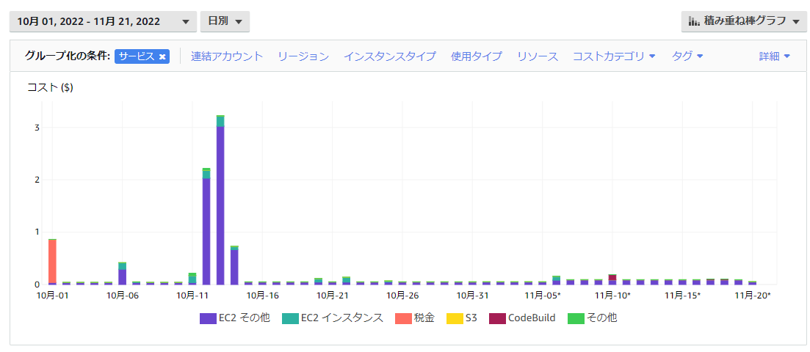

# はじめに

- 有志勉強会第一弾です。
- 今回はアカウント開設 ~ 開設後に知っておきたいtipsについて紹介します。
- AWS始める（触る）のが怖くない状態を目指せれば、と思います。
- もしAWSを触る機会があれば、設定時にこの勉強会の内容を参考にでもして頂ければと思います。

## AWS、始めるの怖くない？

ちなみに私は最初怖かったです。

- お金かかりすぎないかな？
- セキュリティや不正利用とか大丈夫かな？

などなど。

## 安心してください

> お金かかりすぎないかな？

アカウント開設後1年間は無料枠があるので、最初はその予算内で試してみるのがオススメです。

> セキュリティや不正利用とか大丈夫かな？

100%安全！とは保証できませんが、抑えるべき点を本日は紹介します。

## AWS無料枠について

AWSにはアカウント作成日から12カ月間、一部サービスが無料で使える「無料枠」が存在します。
他にも、アカウント作成日に限らず「無期限無料」のサービスも存在します。

「12カ月無料枠」の例

- EC2（コンピューティングサービス）： t2.micro または t3.microのインスタンスが750時間/月
- S3（ストレージサービス）：5GB/月

「無期限無料」の例

- DynamoDB（NoSQL）：25GBのストレージ
- Lambda（サーバーレスコンピューティング）：100万件/月、最大320万秒のコンピューティング時間/月

<https://aws.amazon.com/jp/free/?all-free-tier.sort-by=item.additionalFields.SortRank&all-free-tier.sort-order=asc&awsf.Free%20Tier%20Types=*all&awsf.Free%20Tier%20Categories=*all>

## やらかし事例から学ぼう

無料期間が過ぎてしまったり、またはうっかりミスで失敗してしまう事もあるので、
よくある（？）やらかし事例を紹介します。

### 事例1

Y.Aさんの例。（2021年10月）

月の中で323時間分、DBを起動しっぱなしで＄8.4分かかっていました。
RDS（Relational Database Service）はDBを停止しても8日後に勝手に立ち上がってくる仕様なので気を付けましょう。
※お金をかけたくないなら「ローカルPC上」 or 「EC2内に立てる」 or 「DynamoDBにする」がおすすめです。

### 事例2

こちらもY.Aさんの例。
2021年4月~6月の3カ月間、毎月約＄3.6程度の出費。

Elastic IP（AWS内で使える固定IPアドレス）を取得したまま、放置していたのが原因。
例えばEC2インスタンスに割り当てた場合は無料だが、割り当てていないと＄0.005/1時間の料金が発生してしまいます。

### やらかし事例まとめ

- 個人利用で少し触る程度であれば、多少やらかしても数百円程度で済んでいます（今の所）
- 例えば「結構大きめのEC2やRDSのインスタンスを立ち上げたまま放置」等してしまうと痛い目を見ることになります

## やらかさない為の対策

### AWS Budgets

<https://blog.serverworks.co.jp/tech/2020/06/02/hajimetenoaws_budgets/>

月あたり＄10を予算として設定し、予算の50%、つまり＄5以上の課金が発生する場合には個人のメールアドレスに通知が行くように設定をしています。

### メール通知

請求設定という項目があるので、ここで毎月の請求書を自身のメール宛に受け取るようにしています。
また、「無料利用枠」を超えそうになった場合のアラートも受信するようにしています。

▼こういった形で請求が来ます（内訳も分かります）

▼無料利用枠のアラートはこういった形で来ます

## AWSアカウント作成時にやっておきたい設定

### ルートユーザーについて

- rootユーザーの場合、初期状態ではメールアドレスとパスワードでログインが可能です。
基本的にルートユーザーではなく、権限別に分かれたIAMユーザーを利用することが推奨されています。
（私の場合は2要素認証の有効化+普段使わないので長めのパスワードを設定しています）

- ルートユーザー代わりに、新しくIAMユーザーを発行します。
IAMポリシーと呼ばれる、IAMユーザーやIAMグループに対して権限の付与ができるので、発行したIAMユーザーに対して必要な権限のみ付けておくと良いです

- また、ローカルPCからAWSリソースを操作できるようにするにもIAMユーザーが必要ですが、必要な権限のみ付与する形に留めておく為にも別IAMユーザーとして発行する事をおすすめします。

### 2要素認証の有効化

アカウント保護の為にも、こちらは**必ず**有効化しておきましょう。
rootアカウントだけでなく、後から発行するアカウントも2要素認証は有効化しておきましょう。

### Cloudtrail（追跡管理）

ユーザーの操作ログが残ります。

<https://business.ntt-east.co.jp/content/cloudsolution/column-try-36.html>

### Cost Explorerの有効化

コストや使用状況を表示、分析できるツールです。
EC2のインスタンスサイズ別のコストを閲覧したり、リージョン別の料金等も確認することが出来ます。

### やっておきたい設定まとめ

私の実施している設定を本日紹介しましたが、他にも設定が推奨されている機能は色々あります。
こちら↓のクラスメソッドさんの記事がよくまとまっているので、アカウント作成の際は是非参考にしてみてください

<https://dev.classmethod.jp/articles/aws-1st-step-new-era-reiwa/>

## おまけ：個人的なAWSの勉強方法など紹介

### 公式ドキュメントを読む

良質なドキュメントから学習する方が、結果として効率が良いかなと個人的には考えています。
書籍やQiita等の記事が取っつきやすいのは事実ですが、「AWSのマネジメントコンソールのデザインが大きく変わっており、操作感が異なる」「各サービスの仕様やサポートされている機能が変わっている」事が多々ある為、古い二次情報を掴むよりも最初からドキュメントを見た方が混乱せずに済む場合があります。

### AWS Black Belt

AWSが提供するオンラインセミナーです。
サービスの概要を知りたい場合にオススメです。
セミナーの資料が非常に分かりやすいです。

<https://aws.amazon.com/jp/events/aws-event-resource/archive/?cards.sort-by=item.additionalFields.SortDate&cards.sort-order=desc&awsf.tech-category=*all>

### 社内でどう使われているか、または他社の活用事例を見てみる

サービスの説明を漠然と眺めても中々頭に入ってこないので、活用事例を検索してみると「こういう課題解決の為に使うんだな」と、関連性が見えてくるので個人的にはオススメです。
社内で使われていないようなサービスの場合はJAWS-UG等の勉強会に参加してみると、よりイメージが湧くと思います。

### 資格勉強

AWSには資格が多数あるので、資格を通して浅く広く知識を得るのもオススメです。
