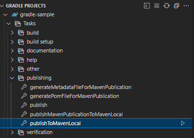

# 勉強会第五回：Gradleについて（ハンズオン）

---

## はじめに

- 今回はインフラではなく、Javaビルドツールの紹介です。
- 最近Gradleを使ってビルドする機会があったので、ハンズオン形式でご紹介します。
- Mavenについて軽く知識がある事を前提として話を進めていきます。
  - Mavenリポジトリについては[こちら](https://maven3.kengo-toda.jp/primer/maven-repository)の説明が分かりやすいです。

---

## ハンズオンの内容

今回は以下を実施します。

- GradleでJavaのプロジェクトをビルドし、Mavenローカルリポジトリ上に公開
- 既存Mavenプロジェクトから自作ライブラリを利用

---

## Gradleとは

- 2007年に誕生したビルドツール
  - Antが2000年、Mavenが2004年
- `build.gradle`という設定ファイルにビルド内容を記載
  - Mavenの`pom.xml`みたいなもの
  - `build.gradle`はGroovyというスクリプト言語で書かれている
  - Groovyではなく、Kotlinでのスクリプト記述も可能

---

## Gradleでできること

- Mavenで作ったライブラリをGradleで読み込んだり、GradleからMaven向けにライブラリをビルドする事も可能
- ビルドの順番や依存関係もすべてスクリプト化する事が可能
  - 設定ファイルだとOKかNGかしか分からない所が、スクリプトだと「何行目のどの記述が間違っているか」が出力される等、デバックが容易

---

## Gradleタスクについて

- Gradleにおいて、複数の処理をひとまとめにしたもの
- `build-gradle`にpluginを足すことでタスクを使えるようにしたり、自前で定義する事も可能
- タスク間の依存関係を定義したり、順序付けをする事も可能

---

## ハンズオン手順

### Gradleのインストール

手元にGradleをchocolateyでインストールします。

```powershell
choco install gradle
```

---

### gradle init、build.gradleの調整、publishコマンドの実行

- まずは任意のディレクトリで`gradle init`を実行します。
- その後、`gradle init`の調整の後にMavenローカルリポジトリへと`publish`をします。
- 詳しくは[こちらの記事](https://qiita.com/yoyoyo_pg/items/61ea8dc2e4e434f53f99)を参考に解説します。
- [こちらのリポジトリ](https://github.com/yoyoyo-pg/gradle-sample#gradle-sample)にハンズオンの内容を置いてあるので、`gradle init`せずともこちらを手元に持ってきて作業頂いても大丈夫です。

---

### IDEを用いたGradleのビルド

- IDEを利用する事で、Gradleのタスク実行をGUIに任せることも可能です。
  - Eclipseの場合、Gradleプロジェクトをインポートすると「Gradleタスク」ビューが利用可能となります。

---

## VSCode拡張機能

- VSCodeの場合はGradle for Javaという拡張機能を利用する事で、GUIによる操作が可能です。
  - 以下はVSCodeの拡張機能を利用した場合のビューです。
  - 

---

## 参考文献

- [Gradleとは何者？インストール方法〜使い方までわかりやすく解説](https://camp.trainocate.co.jp/magazine/about-gradle/)
- [Maven3のはじめかた - Mavenリポジトリ](https://maven3.kengo-toda.jp/primer/maven-repository)
- [Qiita - GradleでMavenローカルリポジトリにpublishをする](https://qiita.com/yoyoyo_pg/items/61ea8dc2e4e434f53f99)
