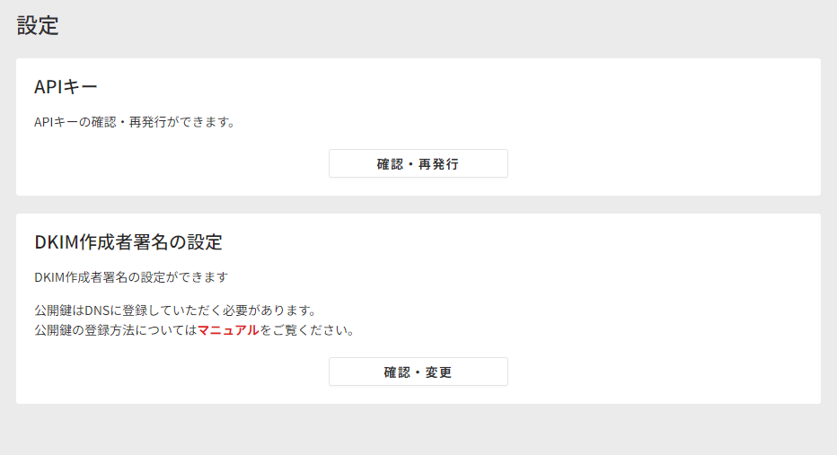
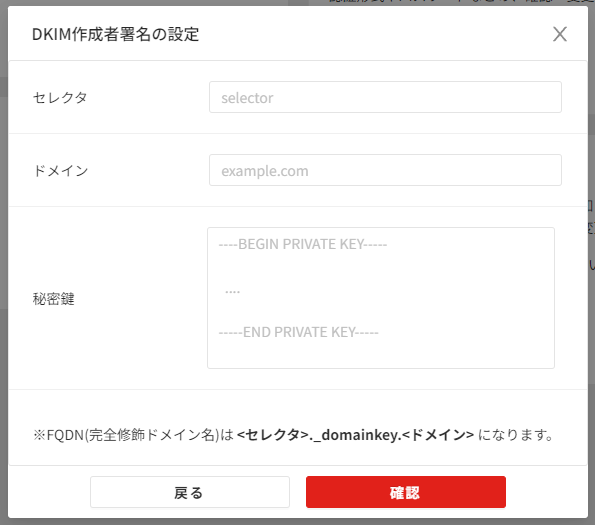
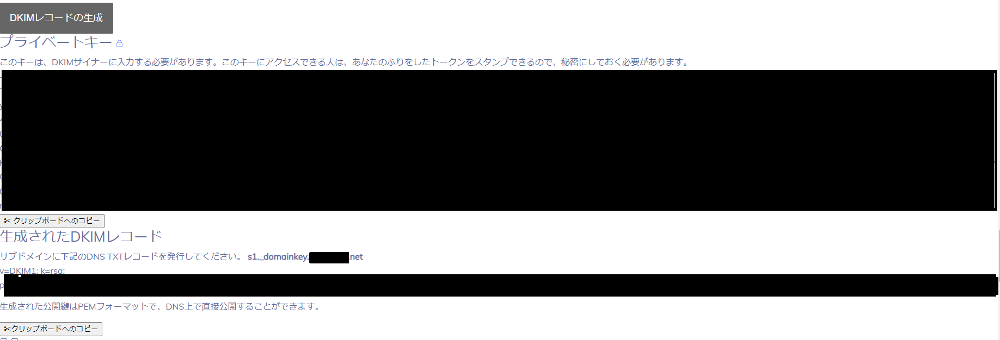
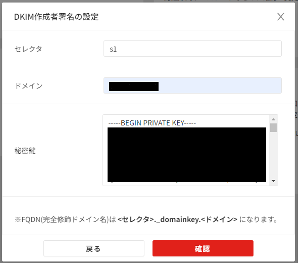
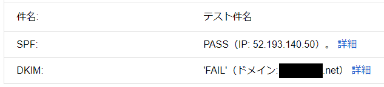
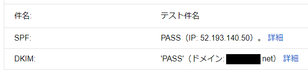
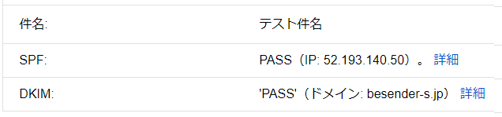
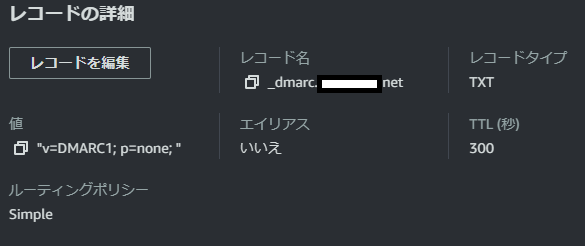
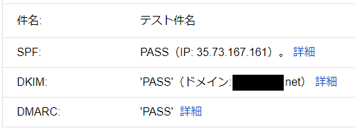
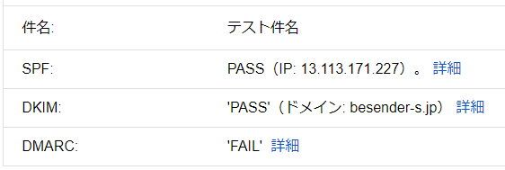

# 勉強会第七回：メールの送信ドメイン認証について

## はじめに

- 2023年10月に、Googleはメール送信の要件を2024年2月から厳しくすると発表しました。
- 何故こういった改定が行われるかというと「メールは簡単に詐称出来てしまう」という背景があります。
- 今回は「メール送信元の詐称」と、その対策である「送信ドメイン認証」について説明します。

## メール送信元の詐称とは

実は、メールというのは非常に簡単に「送信元の詐称」が出来てしまいます。  
例えばメール配信サービスの blastengine を使い、メール配信する場合は例としては以下。

<https://qiita.com/yoyoyo_pg/items/d2c69e91f5449b20a46d#vscode%E4%B8%8A%E3%81%A7%E3%83%A1%E3%83%BC%E3%83%AB%E9%80%81%E4%BF%A1>

「送信元アドレス」「送信者名」は適当な物にしても、メール配信は可能という事になります。

### 詐称が出来てしまうと

こういった詐称を使い、実在する組織やサービスになりすましてユーザにメールが送信できてしまうと、詐欺やマルウェアなどの危険にユーザが晒されることにも繋がります。  

そこでメール送信元の偽装が行われていないことの判別を目的として生まれたのが「送信ドメイン認証」です。

### ドメインって何？

ドメインとはインターネット上の住所の事です。  
例えば`info@yoyoyo-pg.net`というアドレスからメールが送信されてきた場合、送信元ドメインは`yoyoyo-pg.net`という事になります。

## 送信ドメイン認証の歴史

インターネット上の電子メールに用いられる「SMTP（Simple Mail Transfer Protocol）」というプロトコルでは「差出人を自由に名乗る事が出来る」関係で、セキュリティ上の欠陥として、差出人の詐称がありました。その対策として登場したのが送信ドメイン認証です。

まず初めに実験的に策定されたのは、RFC4408（2006年）の SPF です。

## SPF（Sender Policy Framework）とは

「送信メールサーバーのIPアドレスを元に認証し、送信元サーバーの正当性を確認する」のが SPF です。  
メールを送信するドメインの所有者は、「なりすましでない」事を証明する為に SPF レコードを DNS に記載する必要があります。

### DNSへの登録例

登録例ととしては以下。`TXT`レコードに以下の値を登録します。

`"v=spf1 +ip4:192.168.100.0/24 ~all"`

意味としては、IP アドレスが「192.168.100.0/24」の範囲に属するメールサーバーからの送信が「このドメインからの正当なメール送信」とみなされる、という事になります。

### SPFまとめ

- 「このドメインでは、このIPアドレスのサーバーからメール送信するよ」と、ドメイン所有者が宣言する（DNSに記載する）のがSPFでした。
- ただし SPF では、メールヘッダの偽装に対処出来る訳ではありません。
  - あくまで「送信元メールサーバーのドメイン」に対する認証である点には注意が必要です。

### SPF補足

以下の様なツールを利用し、SPF レコードが正しく設定されているかを検証する事も可能です。
[SPF Record Testing Tools](https://www.kitterman.com/spf/validate.html)

## DKIM（DomainKeys Identified Mail）とは

SPF では検知出来ない「メールヘッダ」や「メッセージ本文」の改ざんを検知できるのがDKIMです。  
こちらはRFC4871（2007年）として策定されました。  
DKIMでは、電子署名を利用して改ざんの検証をしています。

以下資料が非常に分かりやすかった為、こちらを参考にしながら解説します。  
[blastmail 迷惑メール対策（DKIM署名）](https://blastmail.jp/function/6.html)

### DKIM設定方法

ここでは、blastengineにDKIMを設定する方法を解説します。（作成者署名）

設定メニューから、以下項目の入力を行います。

まずは[パスワード生成ツール](https://www.luft.co.jp/cgi/randam.php)等で適当な文字列を生成します。  
その後、[DKIMコードジェネレーター](https://powerdmarc.com/ja/power-dmarc-toolbox/)を利用して生成した秘密鍵を、blastengineのコンソールに入力します。

blastengine側で保存後、DNSに`TXT`レコードで公開鍵を保存します。

### DKIM確認方法

#### パターン1

もし仮に

- blastengine側で秘密鍵を設定
- DNS側で公開鍵を未設定

だと、DKIM署名は失敗します。

#### パターン2

- 秘密鍵、公開鍵をどちらも設定

の場合は、DKIM署名は成功します。

#### パターン3

- DNS 側で公開鍵を設定
- blastengine 側で秘密鍵を未設定

の場合は、作成者署名ではなく第三者署名（blastengineのデフォルト設定）が用いられることで、DKIM署名に成功します。

## DMARC (Domain-based Message Authentication, Reporting, and Conformance)とは

DMARCはRFC7489（2015年）で策定されました。

SPF や DKIM との大きな違いは

- それぞれの認証結果のどちらかが pass すればいいこと
- メールヘッダの送信者情報（From:ヘッダ）を認証すること
- メール送信者が認証に失敗したメールの取り扱いを示すことが出来ること

が挙げられます。

DMARCは、SPFやDKIMで認証した送信ドメインと、メールヘッダー上の送信ドメインとが同じでないと、DMARCとしては認証されないという特徴があります。  
つまり、 DMARC の認証が pass したということは、メール受信者に表示されている送信者情報のドメインがなりすまされていないことを示します。

### DMARCの設定

まずは DMARC を設定してみます。最低限の設定は以下です。

#### パターン4

正常なメールを想定したメール送信です。

- DKIM を設定（上記の作成者署名）
- DMARC を設定

の状態だと、DMARCも pass する事が出来ます。

#### パターン5

なりすましメールを想定したメール送信です。

- DKIM を未設定（DNSの公開鍵のみ設定）
- DMARC を設定

の状態だと、DMARC は fail となります。

「SPFかDKIMのどちらかがクリアしていれば、DMARCも pass するのではないか」と思う方もいらっしゃるかもしれませんが、

- spf は blastengineのメールサーバ自体の認証となっている
- dkim は blastengineのデフォルトの第三者署名が適用されている

という事になるので、「今回の送信元ドメインに対しての」spf・dkim は pass していない、という事になるので、 dmarc は fail という事になります。

この状態でも受信者はなりすましメールを受信出来てしまうのですが、  
DKIMレコードの内`p=none`が「DMARC認証に失敗しても何もしない」状態なので、これを`p=quarantine`や`p=refect`にすることで、厳格に対処する事が可能となります。

## まとめ

以上が送信ドメイン認証の概要となっています。  
今回の改定により、この辺りの対応が必要という事になる、という事を頭の片隅に置いておいて頂けると良いと思います。

## 参考文献

- [なりすまし対策ポータル](https://www.naritai.jp/index.html)
- [blastmail 迷惑メール対策（DKIM署名）](https://blastmail.jp/function/6.html)
- [【図解】初めてでも腹落ち！DKIMの仕組みと設定方法](https://blastengine.jp/blog_content/dkim_basic/)
- [DMARCとは？その仕組みと設定方法、SPFやDKIMとの関係](https://www.proofpoint.com/jp/threat-reference/dmarc?gad_source=1&gclid=Cj0KCQiA4NWrBhD-ARIsAFCKwWtl6bM0Z_XokbgJWWUQIUeeNO13MdkSFdB6RAbbmzHJD6zA2XV3hIgaAjhbEALw_wcB)
