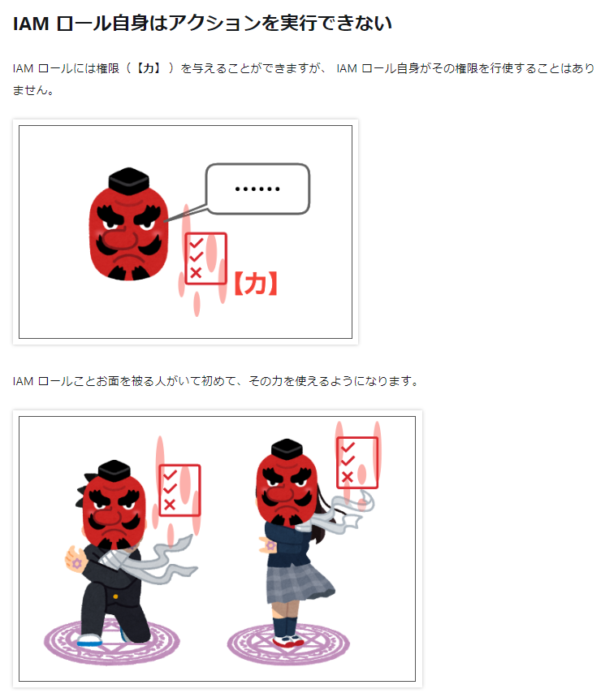
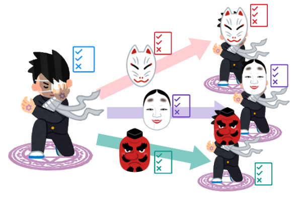

# 勉強会第八回：AWSのIAM（権限回りの仕組み）について

## はじめに

- AWSでは、IAM（Identity and Access Management）という仕組みを使い、AWSリソースに対するセキュアなアクセスを実現しています
- 具体例
  - AWSマネジメントコンソールへのログイン
  - ECSコンテナやLambdaから、S3やDynamoDBへのアクセス（読み書き）
  - Lambdaから、CloudWatchLogsにログの吐き出し
  - 開発用PCからCodeArtifactのリポジトリの参照
- 今回はIAMの概要と、どのような認証認可が実現できるかを説明します

## 話さない事（詳しい方向け）

- AWSルートユーザー
- リソースベースポリシー
- IAM以外のサービス

## そもそもIAMって何よ

> AWS Identity and Access Management (IAM) は、AWS リソースへのアクセスを安全に管理するためのウェブサービスです。IAM を使用すると、ユーザーがアクセスできる AWS のリソースを制御するアクセス許可を集中管理できます。IAM を使用して、誰を認証 (サインイン) し、誰にリソースの使用を認可する (アクセス許可を付与する) かを制御します。

参考：[AWS Identity and Access Management ユーザーガイド](https://docs.aws.amazon.com/ja_jp/IAM/latest/UserGuide/introduction.html)

> 「誰」が「どのAWSのサービスやリソース」に「どのような条件」でアクセスできるかを指定できるサービス

参考：[Qiita - 【2022年版ベストプラクティス】AWS IAMまとめ](https://qiita.com/c60evaporator/items/0121399880625cc1de51)

- 上記の例でも挙げた通り、AWSにおける主に「認可」の面で大きな役割を果たしています
- どのサービスを使うにしても、基本的にはIAMが登場するので、覚えておいて損は無い概念です

## IAMの4つの概念

- ここでは4つのIAMの主要な用語を紹介します
- なお、以下の観点で整理する事が可能です

|観点|IAMユーザ|IAMロール|IAMグループ|
|---|---|---|---|
|実行主体（エンティティ）となりうるか     |〇|〇|×|
|AWSマネジメントコンソールへのログイン認証|〇|×|×|
|AWSCLI等で用いるアクセスキーの発行      |〇|×|×|
|IAMポリシー(※)のアタッチが可能か       |〇|〇|〇|

### IAMポリシー

- IAMポリシーとは、JSONやYAML形式で「誰」が「どのAWSのサービスやリソース」に「どのような条件」でアクセスできるかを定義しています
- このポリシーがアタッチされる事で各種操作が可能となります

### IAMポリシーの例

- Lambdaを動作させる為のベーシックな権限です
- CloudWatch Logsに対して、ロググループの作成とログのイベント作成を許可しています

```json
{
    "Version": "2012-10-17",
    "Statement": [
        {
            "Effect": "Allow",
            "Action": "logs:CreateLogGroup",
            "Resource": "arn:aws:logs:ap-northeast-1:XXXXXXXXXXX:*"
        },
        {
            "Effect": "Allow",
            "Action": [
                "logs:CreateLogStream",
                "logs:PutLogEvents"
            ],
            "Resource": [
                "arn:aws:logs:ap-northeast-1:XXXXXXXXXXX:log-group:/aws/lambda/SampleAPI:*"
            ]
        }
    ]
}
```

### IAMユーザ

- 所謂ユーザ（AWSの利用者）= IAMユーザと最初は覚えて頂いて構いません
  - AWSマネジメントコンソールにも「IAMユーザ」によるログイン認証を行う事が可能です
- AWSの各種操作をする実行の主体となります

### IAMロール

- IAMロールは「お面」のような物だと思って頂くと分かりやすいです
- 「お面」を被る事で、IAMユーザや、EC2、Lambdaは「役割(=力)」が付与されます
  - ただし、IAMユーザに対して直接IAMロールを付与する事は出来ません ※後述します

イメージとしては以下



参考：[IAM ロールの PassRole と AssumeRole をもう二度と忘れないために絵を描いてみた](https://dev.classmethod.jp/articles/iam-role-passrole-assumerole/)

#### IAMロールをIAMユーザに付与したい時

- IAMロールの権限をIAMユーザに付与したい時に利用するのがAssumeRole（アシュームロール）です
  - この場合は「管理者側で、IAMユーザがいつでも「お面」を被れる事を許可」「IAMユーザが「お面」を被る」の二段階の手順を経る事で、IAMユーザは「力」を得ることが可能です
  - これにより、単一のIAMユーザが「お面」を被る事で、ログインしたアカウントとは別のアカウントを操作したり、異なる操作を安全に行う事が可能です



### IAMユーザーグループ

- 例えばIAMユーザを多数作成して、そこに対して個別にIAMポリシーを設定すると手間がかかります
- IAMユーザーグループにユーザを追加する事で、一括で権限の管理が可能です

## まとめ

- IAMロールは「力」を授けます
- 強大な「力」には、同時にリスクも伴います
- その為、適切な「力」を与える設計が必要となります
