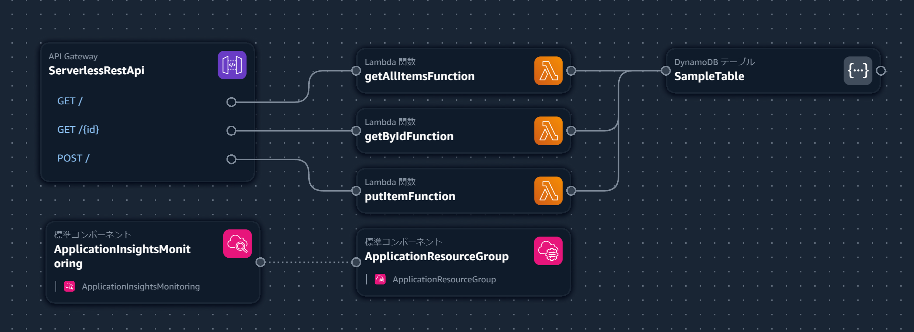
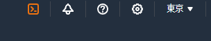
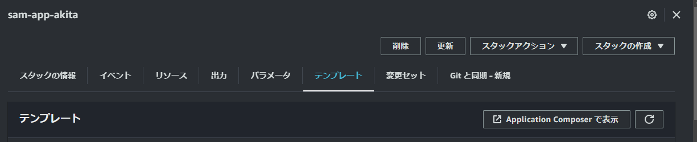
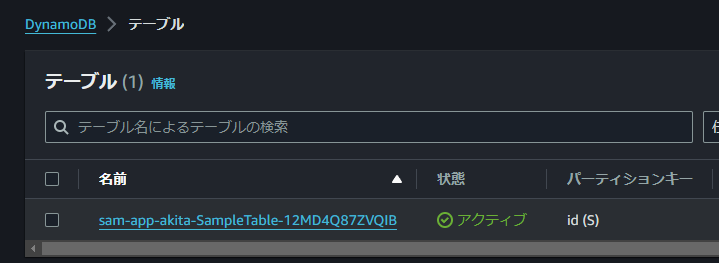
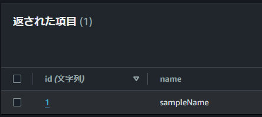

# 勉強会第十一回：AWSのサーバレスハンズオン

## はじめに、サーバレスとは

サーバレスとは、AWSやGCP、Azure等のクラウドプロバイダーがプログラムの実行基盤を管理し、開発者がサーバの構築や管理をしなくてもよい仕組みのことを指します。

AWSでサーバレスを実現する為に、[ユースケースに応じて様々なサービス](https://aws.amazon.com/jp/serverless/)が提供されていますが、今回はサーバレスなWebAPIとしてスタンダードな構成を構築しながら、その要素とサービスについて紹介します。

## 今回構築するもの

GETとPOSTでデータを追加や取得をするWebAPIを構築します。内容については後で解説するので、今はイメージだけ持ってもらえれば大丈夫です。



## ハンズオンパート

という事で今回は早速ハンズオンをしていきます。

AWSのマネジメントコンソールにログイン後、右上のアイコンから[CloudShell](https://ap-northeast-1.console.aws.amazon.com/cloudshell/home?region=ap-northeast-1#)を開いてください。



Cloudshellでは、順に`sam init`と`sam deploy`というコマンドを実行します。このコマンドについても後ほど解説します。

### sam init

```bash
[cloudshell-user@ip-XXX-XXX-XXX-XXX ~]$ sam init
```

1. `Which template source would you like to use?`と聞かれるので、`1`（`1 - AWS Quick Start Templates`）と入力します。
2. `Choose an AWS Quick Start application template`と聞かれるので、`7`（`7 - Serverless API`）と入力します。
3. `Which runtime would you like to use?`と聞かれるので`3`（`3 - nodejs20.x`）と入力します。
4. `Would you like to enable X-Ray tracing on the function(s) in your application?`と聞かれるので`y`と入力します。
5. `Would you like to enable monitoring using CloudWatch Application Insights?`と聞かれるので`y`と入力します。
6. `Would you like to set Structured Logging in JSON format on your Lambda functions?`と聞かれるので`n`と入力します。
7. `Project name`の入力が求められるので`sam-app-名前`と入力します。 ※同一AWSアカウント上での名称の重複を防止する為

### sam deploy

```bash
[cloudshell-user@ip-XXX-XXX-XXX-XXX ~]$ cd sam-app-○○
[cloudshell-user@ip-XXX-XXX-XXX-XXX sam app-○○]$ sam deploy
```

- `Deploy this changeset? [y/N]:`と聞かれるので`y`と入力します。

最終的に、以下の表示が出てきたらサーバレスアプリケーションのデプロイ完了です

```bash
CloudFormation outputs from deployed stack
--------------------------------------------------------------------------------------------------------------------------------------------------------------------------------
Outputs                                                                                                                                                                        
--------------------------------------------------------------------------------------------------------------------------------------------------------------------------------
Key                 WebEndpoint                                                                                                                                                
Description         API Gateway endpoint URL for Prod stage                                                                                                                    
Value               https://XXXXXXXXXX.execute-api.ap-northeast-1.amazonaws.com/Prod/                                                                                          
--------------------------------------------------------------------------------------------------------------------------------------------------------------------------------

Successfully created/updated stack - sam-app in ap-northeast-1
```

> [!Tip]
> このValueの`https://XXXXXXXXXX.execute-api.ap-northeast-1.amazonaws.com/Prod/`は後で利用するので、手元に控えておいてください

## サーバレスなAPIが完成しました

拍子抜けだったのではないでしょうか。実はこれでサーバレスなAPIが完成しています。  

今回の構築はAWSのSAM（Serverless Application Model）と呼ばれるツールを用いて、先程の`sam init`で生成されたテンプレートをもとに、`sam deploy`を行う事で、各種リソースがデプロイされています。

デプロイ自体はCloudFormationというインフラのプロビジョニングツールを用いて行われているため、折角なので[CloudFormationのコンソール](https://ap-northeast-1.console.aws.amazon.com/cloudformation/home?region=ap-northeast-1#/)から構築内容を見てみましょう。

※ `スタック` > `sam-app-○○` > `テンプレート` >  `Application Composerで表示`、から確認できます。



実は、最初に紹介したこちらの構成図は、Application ComposerでCloudFormationのテンプレートを表示した内容でした。


## APIを叩いてみよう

という事で、早速構築されたAPIに対してリクエストを送ってみましょう。

### POSTリクエスト

先程利用したCloudShellを開いて、以下のリクエストを送ります。

```bash
curl -X POST \
  https://生成されたURL.execute-api.ap-northeast-1.amazonaws.com/Prod/ \
  -H 'Content-Type: application/json' \
  -d '{"id": "1", "name": "sampleName"}'
```

それでは、[DynamoDB](https://ap-northeast-1.console.aws.amazon.com/dynamodbv2/home?region=ap-northeast-1#tables)を見てみましょう。



`sam-app-○○-SampleTable`という名前でテーブルが作成されている事が分かります。  
また、`POST`リクエストの内容が登録されている事が分かります。



### GETリクエスト

以下の形で、GETリクエストを行えます。

```bash
# 一覧取得
curl -i https://XXXXXXXXXX.execute-api.ap-northeast-1.amazonaws.com/Prod/
# 一件取得
curl -i https://XXXXXXXXXX.execute-api.ap-northeast-1.amazonaws.com/Prod/id
```

## さいごに、後片付け

SAMで作成したアプリケーションの削除には、`sam delete`コマンドを使います。

```powershell
[cloudshell-user@ip-XXX-XXX-XXX-XXX sam-app-○○]$ sam delete
        Are you sure you want to delete the stack sam-app in the region ap-northeast-1 ? [y/N]: y
        Do you want to delete the template file XXXXXXXXXXXXXXXXXXXX.template in S3? [y/N]: y
```
